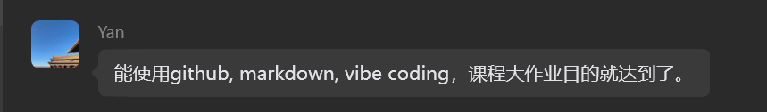
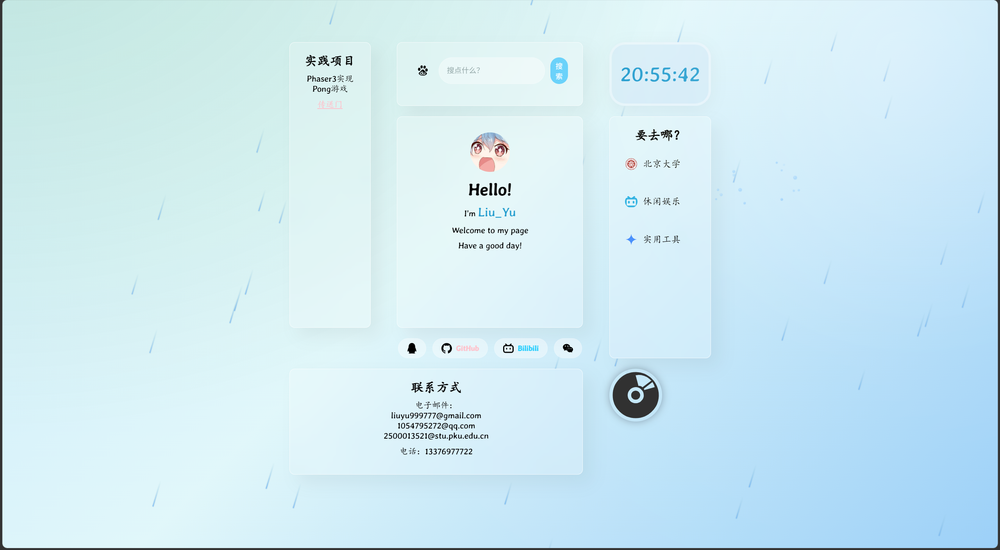
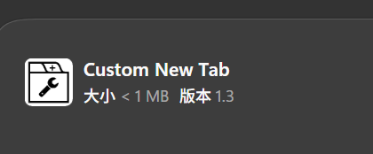
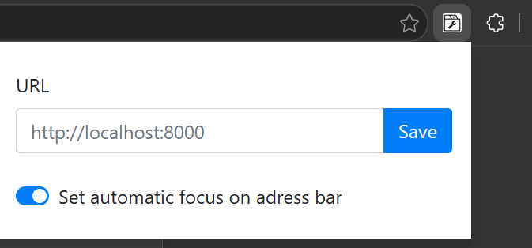
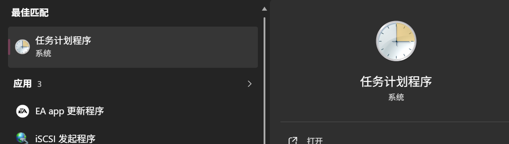

# 一个简单的个人网页前端设计
金于珑 工学院 2500013521
## 项目背景

有这句话我就放心了(bushi),因为期末周比较紧张，加上确实没有什么很有意思的idea可以做所以索性把我自己的个人网页放上来。

这个网页最早是在寒假期间我用来练手web三件套做的，后续因为初版太丑又修改了几次排版，并且从一开始的纯粹手搓，改为加入了一点AI生成的内容来减轻我的工作量，比如背景的下雨特效，点击时的水花效果，都是让ai使用css3自带的canvas，配合javascript实现的。

后续我想要用这个网页作为我浏览器的默认导航页，一开始使用的是edge的插件，但是插件无法正常打开本地网页，而直接用github_page的话，打开存在加载延迟，使用体验不好，因此我让AI生成了一份启动本地服务器的脚本并把它加入开机自启程序当中，再利用edge插件直接访问本地服务器，就实现了更换标签页的效果。

而再后续，由于网页的维护确实有点麻烦，比如导航页内容的增加，我必须先下载图标，再在html文件里加入新的一行link，实在是麻烦且影响使用体验。而此时我已用上了agent，用的是claude code，接deepseek的API，因此我直接把添加导航页内容的活交给agent干，我只需要给网址，它就会自动帮我完成下载图标和加入新链接的工作。除此之外，我对网页的任何调整页可以直接用agent实现（不过对于网页的美化，agent的审美还是有待提升）

至此，我的网页已经完成了从一开始的纯手工→半手工半AI→几乎纯Vibe coding维护的一个转变。

如果要问算法在哪，那倒是真没用上。但是现在vibe coding发展这么快，想加个算法维护的内容其实也不过一句话的事，不过我暂时还没有什么有意思的idea。
至少这个网页我现在开机，点击浏览器就会自动弹出作为新标签页，确实大大提高了我的生产效率（还顺便提升了我的审美享受，edge默认标签页是真的丑，全是广告），所以觉得这个项目还是挺有意义的。

仓库链接：https://github.com/Liuyu999777/Web-
网页github-page链接：https://liuyu999777.github.io/Web-/

如图，右下角的“唱片”点击会旋转并且播放背景音乐，右上角的时钟显示当前时间，各个卡片当鼠标悬浮时会有浮动效果，右侧的是导航页，鼠标悬浮会显示具体的网站。上方为搜索框，左侧点击图标可以切换搜索引擎。左侧是展示窗口，目前就挂了一个“pong”小游戏的网页（使用javascript的游戏引擎phaser3实现）。主卡片下方的4个按钮是个人社交媒体的账号（点击可复制）或者主页链接。

背景有持续的下雨效果，当鼠标点击时会有水花溅出的效果，此效果由AI辅助实现。此外，背景右上角还设置了周期性的黄色光晕以模仿阳光.

打开网页时，各个窗口会以一定顺序从背景中浮动出来，使得网页富有动感，很美观（搞得我有事没事都喜欢打开我的标签页）。

感觉这个网页还有很多可拓展性，比如可以加入本地数据库来储存一些访问信息（比如显示最常访问的链接之类的），但是感觉暂时用不上就没搞。有了vibe coding，加个功能也不过一句话的事而已。

## 核心算法
如上，没用什么核心的“算法”。不过硬要说的话，写css样式表的对象选择器的时候，确实还挺体现面向对象的思维的。一个样式可以被反复调用，也可以在不同的标签下有不同表现，还是很方便的。
使用的语言为HTML+css3+JavaScript

## 运行指南：
如果只是想要打开网页，直接点击HTML文件即可。如果想要实现类似替换标签页的效果，需要
(1)下载浏览器插件。浏览器一般不支持直接替换标签页，不过插件可以实现。以我使用的edge为例，先下载插件"Custom New Tab"（如果是chorme应该也有类似的插件，不过我没用）

(2)下载完之后启用拓展，在右上角就会在表示插件的拼图图标旁边显示插件，此时修改插件设置中的url为http://localhost:8000,该url指向的是本地服务器，目前暂时还没有用，需要下一步的操作

(3)找到项目文件里的silent_run.vbs文件，这是一个脚本文件，可以直接双击执行启动服务器，并且会隐藏服务器窗口。而如果要开机自启，则需要另外的设置，比如在window系统下可以使用

这个系统自带软件，把这个文件加入为开机自启即可。如果设置有问题，这一步也可以完全由agent自己生成代码并加入程序计划。
(4)服务器正常启动后，双击edge，或者点击浏览器上方右侧的“＋”新建标签页，都会弹出该网页

## AI工具声明
使用了claude-code，但是接入的是deepseek的API。此外，开发过程还有咨询Gemini以获取html，css，javescript三件套的编写帮助

## 附关于期末
期末机考遗憾AC4，不过转专业转到了信科智能方向，很感谢老师说可以把我的成绩提到优秀，由于老师说要记得加到文件里，所以我在这里补一句（）

